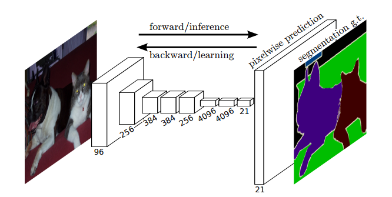
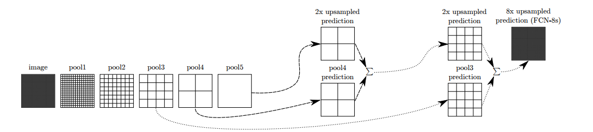
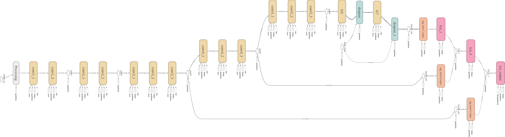

# Semantic Segmentation
## Introduction
Convolutional Neural Networks(CNNs) are driving advances in recognition tasks(speech, image etc.). CNNs are great for making coarse inference but the next step in the progress is to make prediction at pixel level(fine inference).

In this project, I implemented a Fully Convolutional Network (FCN) in Python using Tensorflow to label the pixels of images of streets, this type of classification is called Semantic Segmentation.  

## Project
The FCN design is based on the 2015 paper by researchers
at UC Berkeley https://arxiv.org/pdf/1411.4038.pdf. The idea behind FCN is represented by the image below.

<p align="center">
   
</p>
<p align="center">
   <i>Figure 1: Fully Convolutional Network</i>
</p>

FCNs are designed to work on input images of any size and produces an output of the same spatial dimensions. In this project I attempted on 3 different datasets.

1. Kitti Road dataset
2. Kitti Semantic dataset
3. City Scapes dataset

### Architecture Overview
Typically recognition networks(CNNs) take a fixed sized input and produces non-spatial outputs. Networks like LeNet, AlexNet and VGG are examples of highly accurate networks. The fully connected layers in CNNs can be viewed as convolutions with kernels that cover entire input regions. Doing so casts them into FCNs which take inputs of any size and outputs classification maps.

Reinterpretation of classification nets as FCNs yields output maps for inputs of any size, the output dimensions are typically reduced by subsampling. The classification convolutional networks subsample to keep filters small and computation requirements reasonable. This coarsens the output of a fully convolutional interpretation of these nets, reducing it from the size of the input by a factor equal to the pixel stride of the receptive fields of the output units.

One way to connect coarse outputs to dense pixels is by upsampling using backwards convolution(deconvolution). This fits well with the network computation for end-to-end learning. While this by itself is a good architecture for segmentation the output is still coarse. To address this skip connections from the lower layers with finer strides are be combined with the coarser layers to make local predictions that respect global structure.

Here is the illustration of skip connections(modified from the paper cited above):

<p align="center">
   
</p>
<p align="center">
   <i>Figure 2: Skip Connections</i>
</p>

The final architecture I designed for this project uses a VGG-16 Convnet trained on Imagenet as the encoder and a decoder based on FCN-8 mentioned in the paper cited earlier. The final model as visualized using tensorboard is shown below

<p align="center">
   
</p>
<p align="center">
   <i>Figure 3: FCN-8 model</i>
</p>

### Setup
#### Frameworks and Packages
Make sure you have the following is installed:
 - [Python 3](https://www.python.org/)
 - [TensorFlow](https://www.tensorflow.org/)
 - [NumPy](http://www.numpy.org/)
 - [SciPy](https://www.scipy.org/)

#### Dataset
Download the [Kitti Road dataset](http://www.cvlibs.net/datasets/kitti/eval_road.php) from [here](http://www.cvlibs.net/download.php?file=data_road.zip).  Extract the dataset in the `data` folder.  This will create the folder `data_road` with all the training a test images.

### Start
##### Implement
Implement the code in the `main.py` module indicated by the "TODO" comments.
The comments indicated with "OPTIONAL" tag are not required to complete.
##### Run
Run the following command to run the project:
```
python main.py
```
**Note** If running this in Jupyter Notebook system messages, such as those regarding test status, may appear in the terminal rather than the notebook.

### Submission
1. Ensure you've passed all the unit tests.
2. Ensure you pass all points on [the rubric](https://review.udacity.com/#!/rubrics/989/view).
3. Submit the following in a zip file.
 - `helper.py`
 - `main.py`
 - `project_tests.py`
 - Newest inference images from `runs` folder
