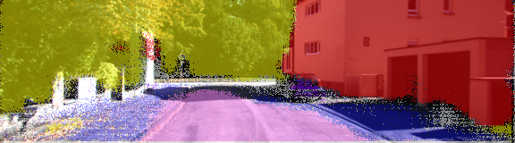

# Semantic Segmentation
## Introduction
Convolutional Neural Networks(CNNs) are driving advances in recognition tasks(speech, image etc.). CNNs are great for making coarse inference but the next step in the progress is to make prediction at pixel level(fine inference).

In this project, I implemented a Fully Convolutional Network (FCN) in Python using Tensorflow to label the pixels of images of streets, this type of classification is called Semantic Segmentation.  

## Project
My FCN design is based on the 2015 [paper](https://arxiv.org/pdf/1411.4038.pdf) by researchers
at UC Berkeley. The idea behind FCN is represented by the image below.

   

   <i>Figure 1: Fully Convolutional Network</i>

FCNs are designed to work on input images of any size and produces an output of the same spatial dimensions. In this project I attempted on 3 different datasets.

1. Kitti Road dataset(Main)
2. Kitti Semantic dataset(Experiment)
3. City Scapes dataset(Experiment)

### Architecture Overview
Typically recognition networks(CNNs) take a fixed sized input and produces non-spatial outputs. Networks like LeNet, AlexNet and VGG are examples of highly accurate CNNs(encoders). The fully connected layers in CNNs can be viewed as convolutions with kernels that cover entire input regions. Doing so casts them into FCNs which take inputs of any size and outputs classification maps.

Reinterpretation of classification nets as FCNs yields output maps for inputs of any size, the output dimensions are typically reduced by subsampling. The classification convolutional networks subsample to keep filters small and computation requirements reasonable. This coarsens the output of a fully convolutional interpretation of these nets, reducing it from the size of the input by a factor equal to the pixel stride of the receptive fields of the output units.

One way to connect coarse outputs to dense pixels is by upsampling using backwards convolution/deconvolution(decoders). This fits well for network computation for end-to-end learning. While this by itself is a good architecture for segmentation the output is still coarse. To address this, skip connections from the lower layers with finer strides are combined with the coarser layers to make local predictions that respect global structure.

An illustration of skip connections in FCN-8 is shown below(modified from the paper cited above):

   

   <i>Figure 2: Skip Connections</i>

The final architecture I designed for this project uses a VGG-16 Convnet trained on Imagenet as the encoder and a decoder based on FCN-8 mentioned in the paper cited earlier. The final model as visualized using tensorboard is shown below

   

   <i>Figure 3: FCN-8 model</i>

### Setup
#### Frameworks and Packages
Make sure you have the following is installed:
 
 - [Python 3](https://www.python.org/)
 - [TensorFlow](https://www.tensorflow.org/)
 - [NumPy](http://www.numpy.org/)
 - [SciPy](https://www.scipy.org/)

#### Main Dataset
Download the [Kitti Road dataset](http://www.cvlibs.net/datasets/kitti/eval_road.php) from [here](http://www.cvlibs.net/download.php?file=data_road.zip).  Extract the dataset in the `data` folder.  This will create the folder `data_road` with all the training a test images.

> **NOTE:**
> The solution in the 'master/hyperparameters' branches is purely based on the dataset described above and doesn't apply to the 'kitti_sem' branch

#### Experimental Dataset
> **NOTE:**
> The datasets below are for the experiments I did in the 'kitti_sem' branch of the repository. DON'T MERGE 'kitti_sem' to the 'master' branch if you are cloning this repository.

1. The first experimental dataset is the modified version found [here](http://adas.cvc.uab.es/s2uad/?page_id=11). The modified version can be downloaded from my personal google drive [link](https://drive.google.com/open?id=0B8AaPRcssKT6MnNGNlg1TW1nQjA). This dataset needs to be under the data folder under the folder name 'KITTI_SEMANTIC'.

2. The second experimental dataset(gtFine\_trainvaltest.zip and leftImg8bit\_trainvaltest.zip) can be found [here](https://www.cityscapes-dataset.com/downloads/). This dataset is huge and I wrote a little script which create 900 samples for training and 100 samples for validation. More on that in the "Experimental Analysis" section below.

#### Code
The code is in the following files:

- `helper.py`
- `main.py`
- `project_tests.py`

The core logic for building and running the model is in `main.py` and `helper.py` with sanity checks logic in `project_tests.py`.

#### Run
Run the following command to run the project:

`python main.py`

>**NOTE:** If running this in Jupyter Notebook system messages, such as those regarding test status, may appear in the terminal rather than the notebook.

#### Main Analysis
The first goal of this project was to train a FCN model to perform semantic segmentaion and classify roads on images from the Kitti Road dataset. So this ended up being only a dual classification problem i.e. road and not-road.

I trained my model on an g3.8xlarge(Tesla M60) AWS Instance. The input size was fixed to 160x576x3, batch size set to 10 and epochs set to 75 with the learning rate of 0.0001. Each epoch(training + validation) took about 55 seconds. Below is the plot of the training and validation loss over 75 epochs.

   

   <i>Figure 4: Kitti Road Loss</i>

As one can see above the training loss and validation loss decay go hand in hand without too many sharp spikes or rapid decay, indicating that the model is not overfitting.

Here are some test images which are outputted by the model.

  |  
| ------------------------- | ------------------------- |
  |  

   <i>Figure 5: Kitti Road Test</i>

As one can see above the model does pretty well in classifying road pixels vs non-road pixels. There are still some cases when the lighting conditions is different, the semantic segmentation is not great. The model can definitely be made robust by adding more augmentation techniques and having a bigger dataset with varying lighting conditions and situations.

#### Experimental Analysis
Although the original goal of this project was to test the model on the Kitti Road dataset, I decided to go a step further and explore two other datasets

##### 1. Kitti Semantic
I found this [dataset](http://adas.cvc.uab.es/s2uad/) while I was reading about semantic segmentation. This dataset is hosted by the researchers of the [WAV Paper](http://adas.cvc.uab.es/s2uad/wp-content/uploads/2014/06/PID3467657.pdf) The dataset is smaller in size when compared to the Kitti Road dataset. 

The original dataset only had training and validation images. But to better test my model, I created a [custom dataset](https://drive.google.com/open?id=0B8AaPRcssKT6MnNGNlg1TW1nQjA) based on the original dataset. The custom dataset divides the original set into training and testing subsets. With my code taking care of the splits into training and validation during model training. 

This dataset had 11 classes(Sky, Building, Road, Sidewalk, Fence, Vegetation, Pole, Car, Sign, Pedestrian and Cyclist). The model I used on the Kitti Road was also used on this dataset. Below is the loss vs epoch(25 seconds each) for the dataset(100 epochs, batch size of 10 and learning rate of 0.0001).

   

   <i>Figure 6: Kitti Semantic Loss</i>

Although the validation loss never went below ~10% the semantic segmentation results were still pretty good as shown below.

  |  
| ------------------------- | ------------------------- |
  |  

   <i>Figure 7: Kitti Semantic Test</i>

##### 2. City Scapes
The final dataset I explored and tested on my model was the City Scapes dataset. This dataset is huge with 5000 original and annotated images each. The dataset has 30 different classes and images from various cities in Germany. 

Since I don't have a GPU to run on and since the training time on AWS Instance for each epoch of this dataset was almost 27 minutes on a g3.8xlarge(Tesla M60) machine, I wrote a small script which downsized the dataset into 900 training images, 100 validation images and 10 test images. 

> **NOTE**:
> The script `downsize.py` does the downsizing in the 'kitti_sem' branch only.  

The training time for each epoch was definitely higher even on the downsized dataset(6.5 minutes each). With a learning rate of 0.0001 and batch size of 10, the loss vs epoch turned out as shown below:

   

   <i>Figure 8: City Scapes Loss</i>

With a validation loss of ~9% at the end of training, the model output looked as shown below.

  |  
| ------------------------- | ------------------------- |
  |  

   <i>Figure 9: City Scapes Test</i>

One thing to notice is that the model in unable to semantically segment buildigin. The color white is supposed to represent 'Unclassified' and charcoal is supposed to represent 'Buildings'. And in the test examples shown above buildings are colored white representing 'Unclassified'. I attribute this to the downsizing of the dataset and the model not having enough samples to learn from. Using my model on the entire dataset would have definitely led to accurate semantic segmentation on images.

## Final thoughts
This was a really fun project to work on and I learnt a lot about the cutting edge work being done in the field of Deep Learning. Although the model performs really well, the robustness could be improved(data augmentation, regularization etc).

The model is very big and inference optimization techniques can be applied to the model and may be even deployed on a mobile phone to apply semantic segmentation on live incoming video. 